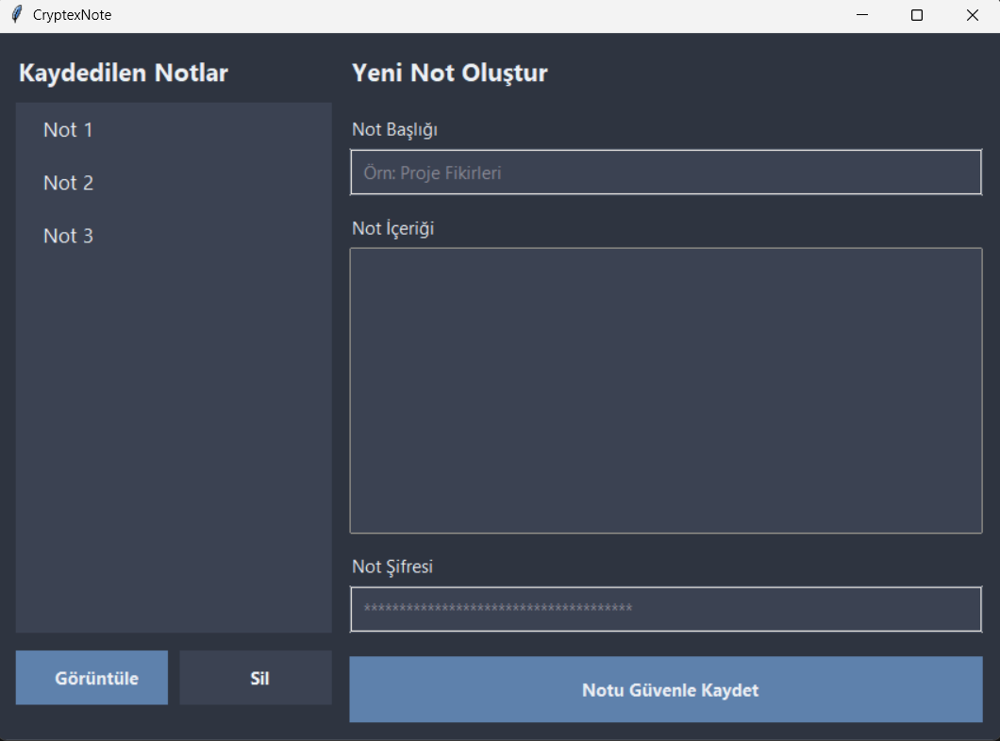

# CryptexNote 🔐

CryptexNote, kullanıcıların notlarını yerel bilgisayarlarında AES-256 şifreleme standardı ile güvenli bir şekilde saklamalarını sağlayan bir masaüstü not alma uygulamasıdır. Her not, kendi benzersiz şifresiyle korunur.

## Ekran Görüntüsü


## ✨ Özellikler

- **Not Oluşturma:** Başlık ve içerik girerek yeni notlar ekleyin.
- **Güçlü Şifreleme:** Her not, kaydederken belirlediğiniz bir parola ile PBKDF2 ve AES-256 kullanılarak şifrelenir.
- **Not Görüntüleme ve Düzenleme:** Şifresini girdiğiniz notun içeriğini görüntüleyin ve üzerinde değişiklik yapın.
- **Güvenli Silme:** Notlarınızı kalıcı olarak silin.
- **Modern Arayüz:** Tkinter ile oluşturulmuş şık ve kullanıcı dostu bir arayüze sahiptir.

## 🚀 Kurulum ve Kullanım

Bu uygulamayı kullanmanın iki yolu vardır:

### 1. Windows Kullanıcıları İçin (.exe)

Programı Python kurmadan direkt çalıştırmak için:
1.  Projenin [**Releases**](https://github.com/yigitfevzitugrul/CryptexNote/releases) sayfasına gidin.
2.  En son sürümün altındaki `CryptexNote-v0.1.zip` dosyasını indirin.
3.  Arşivden çıkardığınız klasördeki `main.exe` dosyasına çift tıklayarak uygulamayı başlatın.

### 2. Geliştiriciler İçin (Kaynak Koddan Çalıştırma)

Projeyi kendi bilgisayarınızda geliştirmek veya kaynak koddan çalıştırmak için:

1.  **Projeyi klonlayın:**
    ```bash
    git clone [https://github.com/yigitfevzitugrul/CryptexNote.git](https://github.com/yigitfevzitugrul/CryptexNote.git)
    cd CryptexNote
    ```

2.  **Sanal ortam oluşturun ve aktif edin:**
    ```bash
    # Windows
    python -m venv .venv
    .\.venv\Scripts\activate
    ```

3.  **Gerekli kütüphaneleri yükleyin:**
    ```bash
    pip install -r requirements.txt
    ```

4.  **Uygulamayı başlatın:**
    ```bash
    python main.py
    ```

## 🛠️ Kullanılan Teknolojiler

- **Python:** Ana programlama dili.
- **Tkinter:** Grafiksel kullanıcı arayüzü (GUI) için standart Python kütüphanesi.
- **Cryptography:** Notların güvenli bir şekilde şifrelenmesi için kullanılan kütüphane.
